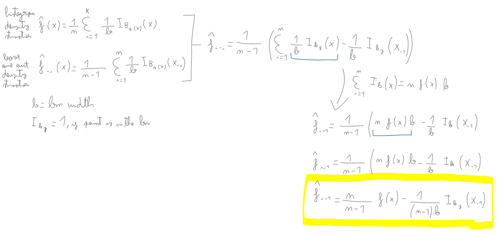

# Exercise 1
To calculate the relation we used the following approach:



# Exercise 2

```{r}
# Read and transform x to numeric
df = read.table("cdrate.dat", col.names = c("x", "y"))
x = df["x"]
class(x) = "Numeric"
x = x$x

A <- min(x)-.05*diff(range(x))
Z <- max(x)+.05*diff(range(x))
nbr <- 7

# Define histogram and the function
hx <- hist(x,breaks=seq(A,Z,length=nbr+1),freq=F, main = "Original data")

hx_f <- stepfun(hx$breaks,c(0,hx$density,0))
```

```{r}
# calculate observed values
observed_values = hx_f(x)

# add them to the histogram
all_data = append(x, observed_values)

A <- min(all_data)-.05*diff(range(all_data))
Z <- max(all_data)+.05*diff(range(all_data))
nbr <- 7

hx <- hist(all_data, breaks=seq(A,Z,length=nbr+1),freq=F, main = "Added observed values", xlab = "x")
```

# Exercise 3

```{r}
leave_one_out_density <- function(data, nbr) {
  n <- length(data)
  loo_density <- numeric(n)  
  
  # Iterate over all points
  for (i in 1:n) {
    
    # Exclude one observation
    data_exclude <- data[-i]
    
    # Fit a new histogram finding new number of breaks
    A <- min(data_exclude)-.05*diff(range(data_exclude))
    Z <- max(data_exclude)+.05*diff(range(data_exclude))
    
    hist_obj <- hist(data_exclude, breaks=seq(A,Z,length=nbr+1), plot=F)
    
    # calculate density: number of points (count) in each interval / width 
    loo_density[i] <- sum(hist_obj$counts) / (n - 1) * (hist_obj$mids[2] - hist_obj$mids[1])
  }
  
  return(loo_density)
}

num_bins <- 7  

# Calculate leave-one-out density and add values the ones previously calculated
loo_density <- leave_one_out_density(x, 2)
all_data2 = append(all_data, loo_density)

# plot 
hx <- hist(all_data2, breaks=seq(A,Z,length=num_bins+1),freq=F, main = "Added points using expression from Exercise 1", xlab = "x")
```

# Exercise 4

```{r}
leave_one_out_log_likelihood <- function(data) {
  n <- length(data)
  log_likelihoods <- numeric(n)  

  # remove one point, fit a normal distribution and calculate
  # probability distribution. Then, the log-likelihood
  for (i in 1:n) {
    # Leave one out
    data_loo <- data[-i]  
    
    mean_loo <- mean(data_loo)
    sd_loo <- sd(data_loo)
    
    left_out_point <- data[i]
    pdf_value <- dnorm(left_out_point, mean = mean_loo, sd = sd_loo)
    
    log_likelihoods[i] <- log(pdf_value)
  }
  
  # the log likelihood is the sum of all iterations
  return(sum(log_likelihoods))  
}

# Compute the leave-one-out log-likelihood
total_log_likelihood <- leave_one_out_log_likelihood(all_data2)
total_log_likelihood
```

# Exercise 5

For exercise 5, we determined the optimal number of histogram intervals (nbr) by calculating the leave-one-out log-likelihood for different values of nbr ranging from 1 to 15. We then selected the value that maximized the log-likelihood as the optimal choice, and used this to plot the final histogram.

```{r}
A <- min(x) - 0.05 * diff(range(x))
Z <- max(x) + 0.05 * diff(range(x))

nbr_values <- seq(1, 15)
looCV_log_lik <- numeric(length(nbr_values))

for (i in 1:length(nbr_values)) {
    nbr <- nbr_values[i]
    hx <- hist(x, breaks = seq(A, Z, length = nbr + 1), plot = FALSE)
    hx_f <- stepfun(hx$breaks, c(0, hx$density, 0))
    
    # Compute the leave-one-out log-likelihood
    loo_log_lik <- sum(log(hx_f(x)[hx_f(x) > 0]))
    looCV_log_lik[i] <- loo_log_lik
}

plot(nbr_values, looCV_log_lik, type = "b", xlab = "Number of Intervals (nbr)", ylab = "LOO Log-Likelihood")
optimal_nbr <- nbr_values[which.max(looCV_log_lik)]

hx_optimal <- hist(x, breaks = seq(A, Z, length = optimal_nbr + 1), plot = FALSE)
plot(hx_optimal, freq = FALSE, main = paste("Histogram with Optimal nbr =", optimal_nbr))


```


# Exercise 6

Here we followed a similar approach to exercise 5, but focused on finding the optimal bin width (b). We evaluated the leave-one-out log-likelihood for a range of possible bin widths and chose the one that maximized the log-likelihood. The histogram was then plotted using this optimal bin width.

```{r}
b_values <- seq((Z - A) / 15, (Z - A) / 1, length = 30)

looCV_log_lik_b <- numeric(length(b_values))

for (i in 1:length(b_values)) {
    b <- b_values[i]
    hx <- hist(x, breaks = seq(A, Z + b, by = b), plot = FALSE)
    hx_f <- stepfun(hx$breaks, c(0, hx$density, 0))
    
    # Compute the leave-one-out log-likelihood
    loo_log_lik <- sum(log(hx_f(x)[hx_f(x) > 0]))
    looCV_log_lik_b[i] <- loo_log_lik
}


plot(b_values, looCV_log_lik_b, type = "b", xlab = "Bin Width (b)", ylab = "LOO Log-Likelihood")
optimal_b <- b_values[which.max(looCV_log_lik_b)]

hx_optimal_b <- hist(x, breaks = seq(A, Z + optimal_b, by = optimal_b), plot = FALSE)
plot(hx_optimal_b, freq = FALSE, main = paste("Histogram with Optimal b =", round(optimal_b, 2)))

```

# Exercise 7

Generate $n=100$ data from $$
f(x) = (3/4)N(x; m = 0, s = 1) +(1/4) N(x; m = 3/2, s = 1/3)$$

```{r}
par(mfrow=c(1,1))

sim.mixt <- function(n=1,k=1, 
         mu=seq(-2*(k-1),2*(k-1),length=k), 
         sigma=seq(1,1,length=k), 
         alpha=seq(1/k,1/k,length=k), graphic=FALSE,...)
{
   csa<-cumsum(alpha)
   x<-runif(n)
      
   for (i in 1:n){
      comp<-sum(csa<=x[i])+1
      x[i]<-rnorm(1,mu[comp],sigma[comp])
   }
   if(graphic) {
      out<-graph.mixt(k, mu, sigma, alpha, gr=FALSE)
      hist(x,freq = FALSE,
           ylim=c(0,max(c(max(out$fx),max(hist(x,plot=FALSE)$density)))))
      lines(out$x,out$fx,lty=1,lwd=2)
   }   
   return(x)
}

graph.mixt<-function(k=1, mu=seq(-2*(k-1),2*(k-1),length=k), sigma=seq(1,1,length=k), alpha=seq(1/k,1/k,length=k), graphic=TRUE,...)
{
   L<-min(mu-3*sigma)
   U<-max(mu+3*sigma)
         
   x<- seq(from=L,to=U,length=200)
   fx<- 0*x
   Salpha<-sum(alpha)
   for(i in 1:k){
   	p<-alpha[i]/Salpha
#   	fx <- fx + p*exp(-.5*((x-mu[i])/sigma[i])^2)/(sqrt(2*pi)*sigma[i])
   	fx <- fx + p*dnorm(x,mu[i],sigma[i])
   }
   if (graphic){
      plot(x,fx,type="l",...)
   }
   return(list(L = L, U = U, x = x, fx = fx))
}

n <- 100
m <- c(0, 3/2)
s <- c(1, 1/3)
a <- c(3/4, 1/4)

x <- sim.mixt(n=n, k=2, mu=m, sigma=s, alpha=a, gr=T)
points(x, 0*x, pch="|")

sigma.mixt <- 1.095287
scott <- 3.49 * sigma.mixt * length(x)^(-1/3)
```

We use the Scott's formula to find the value of b = `scott` (this was done in the density estimation script used in class). The following is the histogram result:

```{r}
A <- min(x)-.05*diff(range(x)) 
Z <- max(x)+.05*diff(range(x))

hx <- hist(x,breaks=seq(A,Z+b,by=scott), plot=F)
plot(hx,freq = FALSE)
```

Now taking the b value maximizing the leave-one-out log-likelihood function. The sequence of proposed b-values to select from is varied from 0.05 to 1.75 in steps of 0.01.

```{r}
b_seq = seq(0.05, 1.75, by=0.01)
b_loo_log_likelihood <- c()

for (b in b_seq) {
  hx <- hist(x,breaks=seq(A,Z+b,by=b), plot=F)
  hx_f <- stepfun(hx$breaks,c(0,hx$density,0))
  y_hist <- hx_f(x)
  y_loo_hist <- (y_hist-(1/(length(x)*b)))*(length(x)/(length(x)-1))
  if (any(y_loo_hist<=0)) {
    b_loo_log_likelihood <- c(b_loo_log_likelihood,-Inf)
  }
  else {
    b_loo_log_likelihood <- c(b_loo_log_likelihood,sum(log(y_loo_hist)))
  }
}
plot(b_seq,b_loo_log_likelihood, pch=16, xlab='Bin Width', ylab = 'log likelihood (leave-one-out)')
```

```{r}
b_ml <- b_seq[which.max(b_loo_log_likelihood)]
```

From this experiment, the leave-one-out cross-validation max log likelihood method selects b = `r`b_ml` as the optimal value for b (out of the proposed values for b). The corresponding histogram can be found below.

```{r}
par(mfrow=c(1,2))

hx_bml <- hist(x,breaks=seq(A,Z+b,by=b_ml), plot=F)
plot(hx_bml,freq = FALSE, main=paste("Histogram with b = ", b_ml))

hx_sc <- hist(x,breaks=seq(A,Z+b,by=scott), plot=F)
plot(hx_sc,freq = FALSE, main=paste("Histogram with b = ", scott))
```

The two suggested values for 𝑏 differ significantly, as seen in the resulting histograms and kernel density estimates. These variations in bin width create distinct impressions of the data. When using Scott's formula, the mixture of the two distributions (in this case, Gaussian distributions) appears less pronounced, making it harder to discern both distributions clearly. In contrast, the bin width derived from the maximum-likelihood method accentuates the presence of two separate patterns, making them more visually evident.

# Exercise 8

In this exercise, the Gaussian kernel is applied, with its bandwidth determined similarly to the bin width in prior exercises. A broad range of bandwidth values is tested (from 0.1 to 1 in increments of 0.01), and a plot of the leave-one-out log-likelihood is generated for each.

```{r}
par(mfrow=c(1,1))

h_seq <- seq(0.1,1, by=0.01)
h_loo_log_likelihood <- c()

for (h in h_seq) {
  kx <- density(x,bw=h,kernel='gaussian')
  kx_f <- approxfun(x=kx$x, y=kx$y, method='linear', rule=2)
  y_density <- kx_f(x)
  y_loo_density <- (y_density-(1/(sqrt(2*pi)*length(x)*h)))*(length(x)/(length(x)-1))
  
    h_loo_log_likelihood <- c(h_loo_log_likelihood,sum(log(y_loo_density)))
}

plot(h_seq,h_loo_log_likelihood, pch=16, xlab='Kernel Bandwidth', ylab = 'log likelihood (leave-one-out)')

h_ml <- h_seq[which.max(h_loo_log_likelihood)]
```

From this experiment, it becomes clear that the optimal max likelihood value for h is `r h_ml`. The corresponding density function is plotted below.

```{r}
kx <- density(x,bw=h_ml,kernel='gaussian')
kx_f <- approxfun(x=kx$x, y=kx$y, method='linear', rule=2)
plot(kx$x, kx$y, xlab='x', ylab = 'density', main = 'Gaussian Kernel Density Estimation')
```

