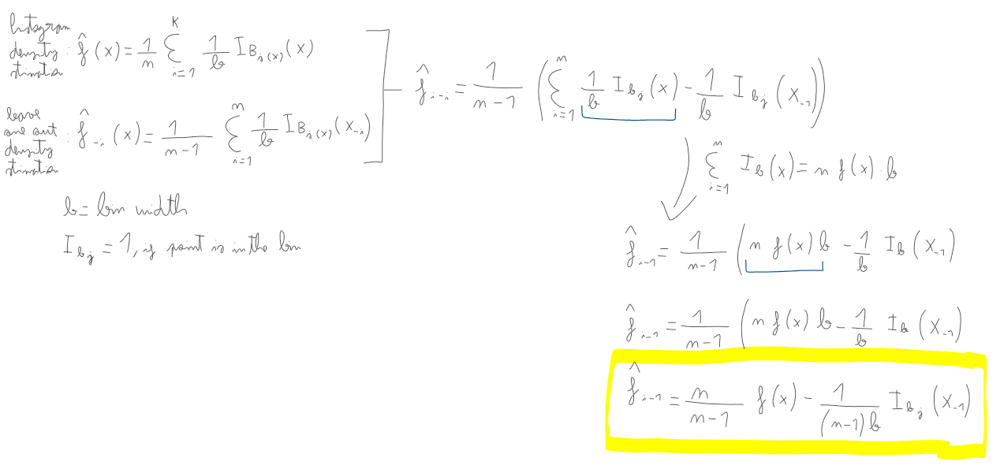

# Exercice 1
To calculate the relation we used the following approach:



# Exercice 2

```{r}
# Read and transform x to numeric
df = read.table("cdrate.dat", col.names = c("x", "y"))
x = df["x"]
class(x) = "Numeric"
x = x$x

A <- min(x)-.05*diff(range(x))
Z <- max(x)+.05*diff(range(x))
nbr <- 7

# Define histogram and the function
hx <- hist(x,breaks=seq(A,Z,length=nbr+1),freq=F, main = "Original data")

hx_f <- stepfun(hx$breaks,c(0,hx$density,0))
```

```{r}
# calculate observed values
observed_values = hx_f(x)

# add them to the histogram
all_data = append(x, observed_values)

A <- min(all_data)-.05*diff(range(all_data))
Z <- max(all_data)+.05*diff(range(all_data))
nbr <- 7

hx <- hist(all_data, breaks=seq(A,Z,length=nbr+1),freq=F, main = "Added observed values", xlab = "x")
```

# Exercice 3

```{r}
leave_one_out_density <- function(data, nbr) {
  n <- length(data)
  loo_density <- numeric(n)  
  
  # Iterate over all points
  for (i in 1:n) {
    
    # Exclude one observation
    data_exclude <- data[-i]
    
    # Fit a new histogram finding new number of breaks
    A <- min(data_exclude)-.05*diff(range(data_exclude))
    Z <- max(data_exclude)+.05*diff(range(data_exclude))
    
    hist_obj <- hist(data_exclude, breaks=seq(A,Z,length=nbr+1), plot=F)
    
    # calculate density: number of points (count) in each interval / width 
    loo_density[i] <- sum(hist_obj$counts) / (n - 1) * (hist_obj$mids[2] - hist_obj$mids[1])
  }
  
  return(loo_density)
}

num_bins <- 7  

# Calculate leave-one-out density and add values the ones previously calculated
loo_density <- leave_one_out_density(x, 2)
all_data2 = append(all_data, loo_density)

# plot 
hx <- hist(all_data2, breaks=seq(A,Z,length=num_bins+1),freq=F, main = "Added points using expression from Exercice 1", xlab = "x")
```

# Exercice 4

```{r}
leave_one_out_log_likelihood <- function(data) {
  n <- length(data)
  log_likelihoods <- numeric(n)  

  # remove one point, fit a normal distribution and calculate
  # probability distribution. Then, the log-likelihood
  for (i in 1:n) {
    # Leave one out
    data_loo <- data[-i]  
    
    mean_loo <- mean(data_loo)
    sd_loo <- sd(data_loo)
    
    left_out_point <- data[i]
    pdf_value <- dnorm(left_out_point, mean = mean_loo, sd = sd_loo)
    
    log_likelihoods[i] <- log(pdf_value)
  }
  
  # the log likelihood is the sum of all iterations
  return(sum(log_likelihoods))  
}

# Compute the leave-one-out log-likelihood
total_log_likelihood <- leave_one_out_log_likelihood(all_data2)
total_log_likelihood
```


